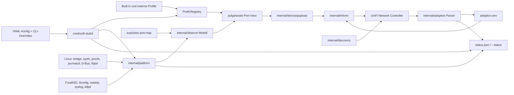

# Architektur

`unifi-stubd` ist ein controller-seitiger Geraete-Emulator. Er stellt einen
Linux-, FreeBSD- oder Bridge-artigen Host als minimalen UniFi-Switch oder als
experimentelle Gateway-Identitaet dar, ist aber kein Host-Provisioning-Agent.
Die Architektur trennt deshalb vier Verantwortungen, die unabhaengig bleiben
muessen:

- Konfiguration und Profilaufloesung;
- read-only Host-Observation;
- controller-seitiges Payload-Rendering;
- persistenter Adoption-State.

Die wichtigste Regel ist einfach: Controller-Daten duerfen lokalen Stub-State
aendern, aber keine Host-Netzwerke, Benutzer, Pakete, Services, Routen,
Firewall-Regeln oder Dateien ausserhalb der expliziten Stub-State-Pfade
veraendern.

## Komponenten-Graph

## Package-Ownership

| Package | Verantwortung | Darf nicht besitzen |
| --- | --- | --- |
| `cmd/unifi-stubd` | CLI, Config-Layering, Validierung, Daemon-Orchestrierung, Operation-Mode-Wiring | Packet-Encoding-Details, OS-spezifisches Parsing, Controller-Protokollinternas |
| `internal/config` | user-facing YAML-Schema, Defaults, striktes Config-Laden | Runtime-Netzwerkreads, Payload-Bau |
| `internal/device` | kanonische Profil-Structs, Built-in-/externe Profil-Registry, YAML-level `extends`, Validierung, Export/Templates, Portdefinitionen und Portaufloesung | Controller-HTTP, OS-Kommandos, JSON-Payload-Tabellenencoding |
| `internal/device/payload` | Switch-/Gateway-JSON-Payloads aus typisiertem Device-Profil, Identity und aufgeloesten Ports | Profil-Laden, Port-Erzeugung, modellbasierte Runtime-Ratespiele, Host-Netzwerk |
| `internal/observe` | normalisierte read-only Observations fuer Bridge- und Port-Map-Modi | direkte Linux-/FreeBSD-Kommandos ausserhalb der Adapter |
| `internal/platform` | read-only OS-Fassade fuer Interfaces, Bridges, LLDP, Logs, procfs, D-Bus, Capabilities | Payload-Rendering, Controller-Adoption-Entscheide |
| `internal/adapters/linuxbridge` | Linux-Bridge-FDB-Command-Parsing | Payload-Policy |
| `internal/adapters/freebsdifconfig` | FreeBSD-Bridge-/Interface-Parser-Helper | Payload-Policy |
| `internal/discovery` | UDP-Discovery-TLV-Bau | Adoption-State |
| `internal/inform` | `TNBU`-Framing, Padding, Verschluesselung, HTTP-Response-Limits | Profilaufloesung |
| `internal/adoption` | Controller-Response-Parsing und lokaler Adoption-Store | Ausfuehren von Controller-Shell-/Provisioning-Kommandos |
| `internal/adoptionssh` | minimaler SSH-Kompatibilitaets-Shim fuer Advanced Adoption | beliebige Shell-Ausfuehrung |

## Runtime-Flow

1. `cmd/unifi-stubd` baut Defaults aus `internal/config`.
2. YAML-Konfiguration wird geladen, falls konfiguriert. Unbekannte YAML-Felder
   sind Fehler.
3. Explizite CLI-Flags ueberschreiben YAML-Werte.
4. Built-in-Profile werden zuerst registriert; optionale `profile_file`- und
   `profile_dir`-Eintraege werden danach geladen.
5. Externes Profil-`extends` wird auf YAML-Mapping-Ebene aufgeloest und danach
   genau einmal in `device.Profile` decodiert. Dadurch bleiben
   absichtliche Zero-Value-Overrides wie `recommended: false`,
   `payload.has_dpi: false` oder `port_names: []` korrekt.
6. Operation-Mode-Validierung prueft aufgeloestes Profil, Portanzahl,
   Management-LAN-Absicht, Bridge-/Port-Map-Einstellungen und Dry-Run-Faehigkeit.
7. Die Plattform-Fassade liest optionale Host-Fakten nur, wenn der gewaehlte
   Modus oder der Statuspfad sie braucht.
8. Profilports, konfigurierte Overrides, passive Observations, Management-LAN-
   Metadaten und Neighbor-Hints werden in `[]device.Port` gemergt.
9. `internal/device/payload` rendert daraus mit Profil und Identity den
   controller-seitigen JSON-Payload.
10. `internal/discovery` und `internal/inform` senden Discovery-/Inform-Traffic,
    ausser Validierung oder Dry-Run stoppen vor Netzwerk-I/O.
11. Controller-Antworten aktualisieren nur lokalen Adoption-Store und Status.

`-validate` nutzt dieselben Config-/Profil-/Operation-Pruefungen, sendet aber
keine Pakete, startet keine Listener und schreibt keine normalisierten Configs.

## Konfiguration und Profile

Konfiguration ist an der Service-Grenze absichtlich explizit. Die paketierte
YAML zeigt jedes unterstuetzte Feld mit konservativen Defaults. Runtime-Defaults
liegen in `internal/config.Default`, waehrend CLI-Registrierung und YAML-
Anwendung dieselbe Setting-Registry in `cmd/unifi-stubd/settings.go` nutzen.

Profile beschreiben die Geraeteform. Sie sind Daten, keine Code-Hooks. Ein
Profil besitzt:

- Modellidentitaet und Display-Metadaten;
- `device_type` und Payload-Art;
- Portanzahl, Namen, Rollen, Network-Groups, Medien und Speed-Layout;
- Payload-Defaults wie Management-Interface-Name, Gateway-Interface-Prefix,
  erforderliche Controller-Version und sichere Feature-Flags.

Das Device-Paket ist die einzige Quelle fuer Profil- und Portdaten. Renderer-
spezifische Views werden aus `device.Profile` und `device.Port` abgeleitet; sie
sind keine eigenen Profil- oder Portmodelle.

Echte Daemon-Starts nutzen vor SSH, Discovery oder Inform eine host-globale
advisory Instanzsperre. `instance_guard: fail` ist der Default und bricht eine
zweite Live-Instanz auf demselben Host ab. Bewusste Multi-Stub-Labs muessen mit
`instance_guard: warn` oder `instance_guard: off` und geprueftem Lock-Pfad
explizit opt-in setzen.

Der Payload-Renderer darf nicht anhand von Modellnamen wie `UXG`, `UXGPRO` oder
`US48P500` Verhalten waehlen. Renderer-Verhalten wird durch Profilfelder
gesteuert: `payload.kind`, Port-Rollen, Port-Medien, Management-Interface und
explizite Overrides.

## Operation-Modi

### `stub`

`stub` ist synthetisch. Der Modus nutzt Profildaten, konfigurierte Nachbarn,
optionale Port-Overrides und generierte Zaehler. Eine Bridge wird nur gelesen,
wenn explizite Legacy-Observation-Flags aus Kompatibilitaetsgruenden gesetzt
sind.

### `bridge-observe`

`bridge-observe` stellt eine Host-Bridge als virtuellen UniFi-Switch dar. Die
Bridge ist die Beobachtungsgrenze. Der Modus ist read-only: VLANs, Bridges,
Routen oder Interfaces werden nicht veraendert.

Der Bridge-Member-Classifier vergibt Rollen, bevor MACs in den Payload gelangen:

- `bridge`: das Bridge-Device selbst, gespeichert als Metadatum, kein UniFi-Port;
- `uplink`: das konfigurierte physische Upstream-Interface oder der einzige
  sichere physisch wirkende Kandidat, wenn kein expliziter Uplink gesetzt ist;
- `access`: VM-/Container-artige Member wie `tap*`, `veth*`, `fwpr*`, `fwln*`,
  `fwbr*`, `epair*` und `vnet*`;
- `unknown`: bleibt fuer deterministisches Mapping geeignet, wenn die Plattform
  nicht sicher klassifizieren kann;
- `ignored`: wird vom Payload-Mapping ausgeschlossen.

MACs, die auf dem Uplink gelernt werden, liegen remote hinter dem echten
Upstream-Switch und werden aus lokalen Access-Port-MAC-Tabellen herausgefiltert.
Ungenutzte Profilports werden getrennt gemeldet, nicht synthetisch up. Dadurch
sieht der Controller den Upstream-Switch oder dessen Downstream-Clients nicht
als direkt am virtuellen Stub-Switch angeschlossen.

`uplink_port` bestimmt, welcher Profilport den dargestellten physischen Uplink
traegt. Das ist bei Mixed-Speed-Profilen wichtig: Ein 48-Port-Switch mit
SFP-/SFP+-Cages sollte einen 10G-Upstream auf den vorgesehenen SFP+-Port legen,
nicht versehentlich auf den letzten GE-Port.

### `port-map`

`port-map` braucht pro Profilport genau eine explizite Quelle:

- `interface`: ein Host-Interface lesen und MAC, IP, Link, Speed/Media und
  Counter uebernehmen, soweit verfuegbar;
- `disabled`: Link down und Speed `0` rendern;
- `unmapped`: Profil-Defaults behalten, ohne physische Sensorquelle.

Dieser Modus ist fuer Appliances oder VMs gedacht, bei denen jeder dargestellte
UniFi-Port auf eine bekannte Host-NIC mappt. Auch dieser Modus ist read-only.

## Plattform-Fassade

`internal/platform` ist die einzige Runtime-Grenze, die optionale Host-
Funktionen ansprechen darf. Sie stellt kleine Interfaces bereit:

- `InterfaceReader` fuer Link-State, Adressen, Speed/Media und Counter;
- `BridgeReader` ueber `observe.ObservationSource`;
- `LLDPReader` fuer passives `lldpcli -f json show neighbors`;
- `LogReader` fuer `journalctl` oder Syslog-Dateien;
- `ProcReader` fuer Linux-`/proc/net/dev`-Counter;
- `ServiceBus` fuer optionale D-Bus-Capability-Pruefungen.

Die Plattform-Schicht meldet Capability-State als `disabled`, `available`,
`missing` oder `unsupported`. Fehlende optionale Tools sind Status-Warnungen,
kein Grund fuer Host-Mutation oder Dependency-Installation.

## Payload-Grenze

Payload-Rendering startet erst nach Profil- und Observation-Aufloesung. Der
Renderer erhaelt:

- das aufgeloeste `device.Profile`;
- controller-seitige Identity;
- eine geordnete, aufgeloeste Portliste.

Switch-Payloads leiten `if_table`, `ethernet_table` und `port_table` aus diesen
Daten ab. Gateway-Payloads leiten `if_table`, `network_table`, `port_table`,
`config_port_table`, `ethernet_overrides`, `uplink_table`, `reported_networks`
und WAN-Statuszeilen aus denselben Daten ab. Explizit konfigurierte
Zuweisungsmetadaten wie `portconf_id`, `networkconf_id`,
`native_networkconf_id`, `network_name` und `vlan` koennen in den
Gateway-Porttabellen gespiegelt werden. Dadurch bleiben Speed, Medium, MAC, IP,
Source-Interface, WAN-/LAN-Rolle, Network-Group, Counter,
MAC-Table-Eintraege und Management-LAN-Metadaten synchron.

Management-LAN ist Payload-Metadatum oder Bindung an ein bereits bestehendes
lokales Interface. `planned-host-vlan` bleibt nur Dry-Run-Plan. Der Daemon legt
keine Host-VLANs an.

## Controller-Grenze

Das controller-seitige Protokoll hat drei getrennte Pfade:

- UDP-Discovery meldet die Fake-Geraeteidentitaet;
- HTTP-Inform sendet verschluesselte `TNBU`-Payloads und empfaengt Adoption-/
  Provisioning-Antworten;
- der optionale SSH-Shim akzeptiert nur die minimalen Kommandos fuer Advanced-
  Adoption-Kompatibilitaet.

Adoption-Antworten duerfen lokale Werte wie `STATE`, `AUTHKEY`, `CFGVERSION`,
`USE_AES_GCM`, `VERSION` und `INFORM_URL` aktualisieren. Forget,
delete/remove und restore-default werden als lokaler Stub-Reset interpretiert.
Sie loeschen Adoption-State und lassen den naechsten Inform wieder wie
Factory-Default aussehen.

Provisioning-Kommandos, die den Host betreffen wuerden, werden nur als
ignorierte Metadaten zusammengefasst. Beliebige Controller-Shell-Kommandos
werden nicht ausgefuehrt.

## Persistenz und Status

Persistenter State ist absichtlich eng:

| Datei | Zweck |
| --- | --- |
| `/var/lib/unifi-stubd/adoption.env` | Linux-Adoption-Store: State, Authkey, cfgversion, Inform-URL, Cipher-Praeferenz |
| `/var/lib/unifi-stubd/status.json` | Linux-sanitized Runtime-Status |
| `/var/db/unifi-stubd/adoption.env` | FreeBSD-Adoption-Store |
| `/var/db/unifi-stubd/status.json` | FreeBSD-sanitized Runtime-Status |

Status-Ausgabe muss fuer Betreiber nuetzlich, aber teilbar bleiben. Sie meldet
Identity, gewaehltes Profil, Operation-Mode, Observation-Zusammenfassung,
Plattform-Capabilities und letztes Inform-Ergebnis. Sie darf keine Adoption-
Authkeys, Controller-Tokens, SSH-Passwoerter, privaten Captures oder rohen
Lab-Secrets ausgeben.

## Topologie-Grenzen

UniFi Network berechnet Topologie-Links aus mehreren controller-seitigen
Signalen. Der Stub kann Hinweise liefern, aber den Controller-Graph nicht
vollstaendig kontrollieren.

`uplink_neighbor` speist aktuell den MAC-Table-Hinweis auf dem Uplink-Port. Ein
Controller kann daraus `port_table[].last_connection`, `uplink.uplink_mac`,
`uplink.uplink_device_name` und teilweise `uplink.uplink_remote_port` ableiten.
Wenn der Stub aber eine physische Host-MAC meldet, die ein echter
Upstream-UniFi-Switch bereits auf seinem eigenen Port sieht, kann der Controller
diese reale Beobachtung bevorzugen und die dargestellte Kante umdrehen. Fuer
Darstellungs-Tests sollte deshalb eine synthetische lokal administrierte
Stub-MAC genutzt werden, ausser genau diese Physical-MAC-Heuristik ist das
Testziel.

LLDP ist hilfreich, aber optional. Ohne LLDP bleibt `uplink_neighbor` manuell.
Mit LLDP sollte Nachbarerkennung manuelle Fehler reduzieren, aber der Controller
besitzt weiterhin das finale Topologie-Rendering.

## Safety-Regeln

Diese Regeln sind architektonisch, nicht nur Implementierungsstil:

- kein controller-seitiges Shell-Kommando wird als Shell ausgefuehrt;
- kein Controller-Provisioning wird auf Host-Netzwerk angewandt;
- kein Package-Manager, Service-Manager, Firewall-, Routing- oder User-Store
  wird durch Adoption veraendert;
- `bridge-observe` und `port-map` sind read-only Observations;
- `management_lan` legt in dieser Version keine VLAN-Devices an;
- private Controller-URLs, Tokens, echte MAC-Tabellen und Captures bleiben aus
  Git heraus;
- Profilwechsel unter derselben MAC werden nicht migriert; nutze neue Fake-MAC,
  Controller-Forget oder lokalen Reset.

## OS-Support-Matrix

| Quelle | Linux | FreeBSD/OPNsense |
| --- | --- | --- |
| `stub`-Profilpayload | unterstuetzt | unterstuetzt |
| `bridge-observe` FDB | `bridge fdb show br <bridge>` plus Member-Rollenklassifikation | Parser fuer `ifconfig <bridge> addr` plus dasselbe Member-Rollenmodell; Runtime-Paritaet bleibt konservativ |
| `bridge-observe` Counter/Speed | `/sys/class/net`, optionale `/proc/net/dev`-Counter | reichere Bridge-Counter geplant; `port-map` kann Interface-Metadaten lesen |
| `port-map` Interface-Metadaten | `net.Interface`, sysfs, optionale Command-Fallbacks | `net.Interface`, optional `ifconfig`/`netstat` |
| passives LLDP | `lldpcli -f json show neighbors` | `lldpcli -f json show neighbors`, wenn lldpd installiert ist |
| Logs | optional `journalctl --output=json` | optionale Syslog-Datei, Default `/var/log/messages` |
| D-Bus | optionale System-/Session-Bus-Pruefung | optionale Best-Effort-Pruefung |
| Event-Subscription | geplant | geplant |
| Native Helper/C++ | nicht genutzt | nicht genutzt |

## Bekannte Erweiterungspunkte

- `uplink_neighbor.remote_port` als explizite Topologie-Metadaten.
- LLDP-abgeleitete Uplink-Nachbarwahl mit manuellem Override.
- reichere FreeBSD-Media-/Counter-Reader, eventuell ueber `x/sys/unix`.
- Event-Subscriptions fuer Bridge-/FDB-Aenderungen statt Polling.
- aktiver macvlan-/ipvlan- oder VLAN-Lifecycle nur nach separatem Review-Design.
