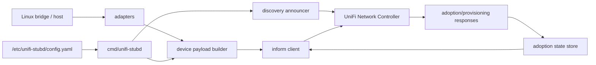
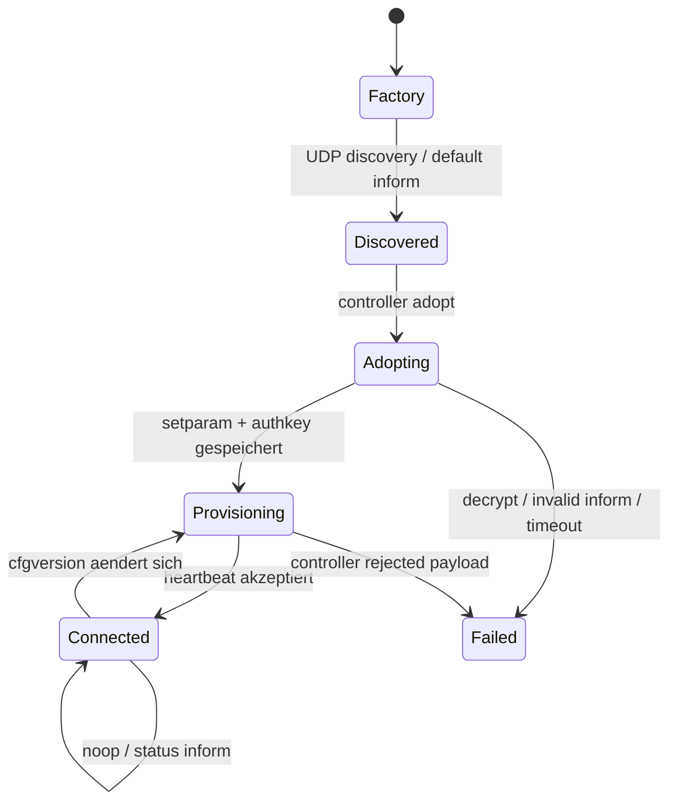

# Architecture

## Komponenten

## Packages

| Package | Aufgabe |
| --- | --- |
| `cmd/unifi-stubd` | CLI/Daemon-Einstieg |
| `internal/discovery` | UDP-Discovery-TLVs bauen und senden |
| `internal/inform` | `TNBU`-Pakete encoden/decoden |
| `internal/adoption` | Authkey, cfgversion und Lifecycle-State |
| `internal/device` | UniFi-Status-Payloads bauen |
| `internal/adapters/linuxbridge` | Linux-Bridge-FDB in MAC-Tabelle uebersetzen |
| `internal/observe` | Read-only Linux-sysfs-/FDB-Snapshot und Payload-Merge |
| `internal/config` | Konfiguration laden |

## Runtime Layout

| Pfad | Inhalt |
| --- | --- |
| `/usr/local/bin/unifi-stubd` | Programmcode/Binary |
| `/etc/unifi-stubd/config.yaml` | Betriebsconfig fuer Controller, Profil, MAC/IP, SSH-Adoption und Port-Speed |
| `/etc/unifi-stubd/ssh_host_rsa_key` | SSH-Hostkey fuer die Fake-Adoption |
| `/var/lib/unifi-stubd/adoption.env` | persistenter Controller-State, Authkey, CFG-Version und Inform-URL |

## State Machine

## Design-Entscheide

### Fake-Switch vor Fake-Gateway

Ein Switch-Profil braucht hauptsaechlich Ports, Interface-Status, MAC-Tabellen und Zaehler. Ein Gateway-Profil braucht WAN/LAN, Routing, DHCP, DPI, Firewall, Health und haeufig mehr Controller-spezifische Erwartungen. Deshalb ist der Switch-MVP deutlich robuster.

### Keine echte Provisionierung

Controller-Kommandos werden zuerst nur interpretiert und persistiert, nicht auf den Host angewandt. Alles, was den Host veraendern wuerde, landet in Logs oder in einer Debug-Ausgabe.

### Lab-Version pinnen

UniFi Network aendert implizite Payload-Erwartungen. Fuer Entwicklung sollte eine Controller-Version in einer VM fixiert werden. Danach koennen weitere Versionen in einer Kompatibilitaetsmatrix getestet werden.

## Datenquellen fuer Proxmox

| Datenquelle | UniFi-Ziel |
| --- | --- |
| `bridge fdb show` | `port_table[].mac_table`, nach Bridge-Member gruppiert |
| `/sys/class/net/<if>/statistics/*` | rx/tx bytes, packets, errors |
| `ip -json addr` | `if_table` |
| `lldpcli -f json show neighbors` | spaetere Nachbarschaftshinweise |
| Proxmox API | VM-Namen zu MACs mappen |
