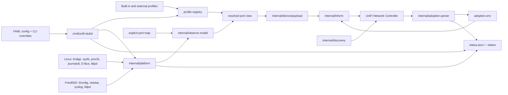

# Architecture

`unifi-stubd` is a controller-facing device emulator. It renders a Linux,
FreeBSD, or bridge-like host as a minimal UniFi switch or experimental gateway
identity, but it is not a host provisioning agent. The architecture therefore
separates four concerns that must stay independent:

- configuration and profile resolution;
- read-only host observation;
- controller-facing payload rendering;
- adoption state persistence.

The main invariant is simple: controller data may change local stub state, but
it must not mutate host networking, users, packages, services, routes, firewall
rules, or files outside the explicit stub state paths.

## Component Graph

## Package Ownership

| Package | Responsibility | Must not own |
| --- | --- | --- |
| `cmd/unifi-stubd` | CLI, config layering, validation, daemon orchestration, operation-mode wiring | packet encoding details, OS-specific parsing, controller protocol internals |
| `internal/config` | user-facing YAML schema, defaults, strict config loading | runtime network reads, payload construction |
| `internal/device/profilemodel` | canonical profile structs used by built-ins and external YAML | file discovery or merge policy |
| `internal/device/profiledata` | built-in/external profile registry, YAML-level `extends`, validation, export/template helpers | live interface reads |
| `internal/device` | profile resolution, port definitions, high-level payload API | controller HTTP, OS commands |
| `internal/device/payload` | switch/gateway JSON payload rendering from typed profile, identity, and ports | model-specific runtime guesses, host networking |
| `internal/observe` | normalized read-only observations for bridge and port-map modes | direct Linux/FreeBSD command execution outside adapters |
| `internal/platform` | read-only OS facade for interfaces, bridges, LLDP, logs, procfs, D-Bus, capabilities | payload rendering, controller adoption decisions |
| `internal/adapters/linuxbridge` | Linux bridge FDB command parsing | payload policy |
| `internal/adapters/freebsdifconfig` | FreeBSD bridge/interface parser helpers | payload policy |
| `internal/discovery` | UDP discovery TLV construction | adoption state |
| `internal/inform` | `TNBU` framing, padding, encryption, HTTP response limits | profile resolution |
| `internal/adoption` | controller response parsing and local adoption store | executing controller shell/provisioning commands |
| `internal/adoptionssh` | minimal SSH compatibility shim for advanced adoption | arbitrary shell execution |

## Runtime Flow

1. `cmd/unifi-stubd` builds defaults from `internal/config`.
2. YAML config is loaded, if configured. Unknown YAML fields are errors.
3. Explicit CLI flags override YAML values.
4. Built-in profiles are registered first; optional `profile_file` and
   `profile_dir` entries are loaded afterwards.
5. External profile `extends` is resolved at YAML mapping level, then decoded
   once into the canonical profile model. This preserves intentional zero-value
   overrides such as `recommended: false`, `payload.has_dpi: false`, or
   `port_names: []`.
6. Operation-mode validation checks the resolved profile, port count,
   management-LAN intent, bridge/port-map settings, and dry-run ability.
7. The platform facade reads optional host facts only when the selected mode or
   status path asks for them.
8. Profile ports, configured overrides, passive observations, management-LAN
   metadata, and neighbor hints are merged into one resolved port view.
9. `internal/device/payload` renders the controller-facing JSON payload from
   that port view.
10. `internal/discovery` and `internal/inform` send discovery/inform traffic
    unless validation or dry-run mode stops before network I/O.
11. Controller responses update only the local adoption store and status.

`-validate` runs the same config/profile/operation checks without sending
packets, starting listeners, or writing normalized config files.

## Configuration And Profiles

Configuration is intentionally explicit at the service boundary. The packaged
YAML shows every supported field with conservative defaults. Runtime defaults
live in `internal/config.Default`, while CLI registration and YAML application
share the setting registry in `cmd/unifi-stubd/settings.go`.

Profiles describe device shape. They are data, not code hooks. A profile owns:

- model identity and display metadata;
- `device_type` and payload kind;
- port count, names, roles, network groups, media, and speed layout;
- payload defaults such as management interface name, gateway interface prefix,
  required controller version, and safe feature flags.

The payload renderer must not branch on model names such as `UXG`, `UXGPRO`, or
`US48P500` to decide behavior. Renderer behavior is driven by profile fields:
`payload.kind`, port roles, port media, management interface, and explicit
overrides.

## Operation Modes

### `stub`

`stub` is synthetic. It uses profile data, configured neighbors, optional
per-port overrides, and generated counters. It does not inspect a bridge unless
explicit legacy observation flags are configured for compatibility.

### `bridge-observe`

`bridge-observe` represents a host bridge as a virtual UniFi switch. The bridge
is the observation boundary. It is read-only: no VLAN, bridge, route, or
interface mutation is performed.

The bridge member classifier assigns roles before MACs reach the payload:

- `bridge`: the bridge device itself, stored as metadata, not a UniFi port;
- `uplink`: the configured physical upstream interface, or the only safe
  physical-looking candidate when no explicit uplink is configured;
- `access`: VM/container style members such as `tap*`, `veth*`, `fwpr*`,
  `fwln*`, `fwbr*`, `epair*`, and `vnet*`;
- `unknown`: kept eligible for deterministic mapping when the platform cannot
  classify it safely;
- `ignored`: excluded from payload mapping.

MACs learned on the uplink are remote behind the real upstream switch and are
filtered out of local access-port MAC tables. Unused profile ports are reported
disconnected, not synthetic-up. This prevents the controller from seeing the
upstream switch or its downstream clients as directly attached to the virtual
stub switch.

`uplink_port` controls which profile port carries the represented physical
uplink. This matters for mixed-speed profiles: a 48-port switch with SFP/SFP+
cages should put a 10G upstream on the intended SFP+ port, not on the last GE
port by accident.

### `port-map`

`port-map` requires one explicit source per profile port:

- `interface`: read one host interface and copy MAC, IP, link, speed/media, and
  counters when available;
- `disabled`: render link down and speed `0`;
- `unmapped`: keep profile defaults without a physical sensor source.

This mode is for appliances or VMs where each represented UniFi port maps to a
known host NIC. It is still read-only.

## Platform Facade

`internal/platform` is the only runtime boundary allowed to talk to optional
host facilities. It exposes small interfaces:

- `InterfaceReader` for link state, addresses, speed/media, and counters;
- `BridgeReader` through `observe.ObservationSource`;
- `LLDPReader` for passive `lldpcli -f json show neighbors`;
- `LogReader` for `journalctl` or syslog files;
- `ProcReader` for Linux `/proc/net/dev` counters;
- `ServiceBus` for optional D-Bus capability checks.

The platform layer reports capability state as `disabled`, `available`,
`missing`, or `unsupported`. Missing optional tools are status warnings, not a
reason to mutate the host or install dependencies.

## Payload Boundary

Payload rendering starts after profile and observation data are resolved. The
renderer receives:

- a normalized payload profile;
- controller-facing identity;
- a resolved ordered port list.

Switch payloads derive `if_table`, `ethernet_table`, and `port_table` from that
data. Gateway payloads derive `if_table`, `network_table`, `uplink_table`,
`config_port_table`, `ethernet_overrides`, and `reported_networks` from the
same data. This keeps speed, media, MAC, IP, source interface, WAN/LAN role,
network group, counters, MAC table entries, and management-LAN metadata aligned.

Management LAN is payload metadata or binding to a preexisting local interface.
`planned-host-vlan` remains dry-run-plan only. The daemon does not create host
VLANs.

## Controller Boundary

The controller-facing protocol has three separate paths:

- UDP discovery advertises the fake device identity;
- HTTP inform sends encrypted `TNBU` payloads and receives adoption/provisioning
  responses;
- the optional SSH shim accepts only the minimal commands needed for advanced
  adoption compatibility.

Adoption responses may update local values such as `STATE`, `AUTHKEY`,
`CFGVERSION`, `USE_AES_GCM`, `VERSION`, and `INFORM_URL`. Forget,
delete/remove, and restore-default responses are interpreted as a local stub
reset. They clear adoption state and make the next inform look factory-default
again.

Provisioning commands that would affect the host are summarized as ignored
metadata. Arbitrary controller shell commands are not executed.

## Persistence And Status

Persistent state is intentionally narrow:

| File | Purpose |
| --- | --- |
| `/var/lib/unifi-stubd/adoption.env` | Linux adoption store: state, authkey, cfgversion, inform URL, cipher preference |
| `/var/lib/unifi-stubd/status.json` | Linux sanitized runtime status |
| `/var/db/unifi-stubd/adoption.env` | FreeBSD adoption store |
| `/var/db/unifi-stubd/status.json` | FreeBSD sanitized runtime status |

Status output must be useful for operators but safe to share. It reports
identity, selected profile, operation mode, observation summary, platform
capabilities, and last inform result. It must not print adoption authkeys,
controller tokens, SSH passwords, private captures, or raw lab secrets.

## Topology Limits

UniFi Network calculates topology links from several controller-side signals.
The stub can provide hints, but it cannot fully control the controller's graph.

`uplink_neighbor` currently feeds the uplink port MAC-table hint. A controller
can turn that into `port_table[].last_connection`, `uplink.uplink_mac`,
`uplink.uplink_device_name`, and sometimes `uplink.uplink_remote_port`.
However, if the stub reports a physical host MAC that a real upstream UniFi
switch already sees on its own port, the controller can prefer that real
observation and reverse the displayed edge. Use a synthetic locally administered
stub MAC for representation tests unless the physical-MAC heuristic itself is
the test target.

LLDP is helpful but optional. Without LLDP, `uplink_neighbor` is manual. With
LLDP, neighbor discovery should reduce manual mistakes, but the controller still
owns final topology rendering.

## Safety Rules

These rules are architectural, not just implementation preferences:

- no controller-provided shell command is executed as a shell;
- no controller provisioning data is applied to host networking;
- no package manager, service manager, firewall, routing, or user database is
  changed by adoption;
- `bridge-observe` and `port-map` are read-only observations;
- `management_lan` never creates VLAN devices in the current release;
- private controller URLs, tokens, real MAC tables, and captures stay out of
  Git;
- profile changes under the same MAC are not migrated; use a new fake MAC,
  controller forget, or local reset.

## OS Support Matrix

| Source | Linux | FreeBSD/OPNsense |
| --- | --- | --- |
| `stub` profile payload | supported | supported |
| `bridge-observe` FDB | `bridge fdb show br <bridge>` plus member role classification | `ifconfig <bridge> addr` parser plus the same member role model; runtime parity remains conservative |
| `bridge-observe` counters/speed | `/sys/class/net`, optional `/proc/net/dev` counters | planned for richer bridge counters; `port-map` can read interface metadata |
| `port-map` interface metadata | `net.Interface`, sysfs, optional command fallbacks | `net.Interface`, optional `ifconfig`/`netstat` |
| passive LLDP | `lldpcli -f json show neighbors` | `lldpcli -f json show neighbors` when lldpd is installed |
| logs | optional `journalctl --output=json` | optional syslog file, default `/var/log/messages` |
| D-Bus | optional system/session bus availability check | optional best-effort availability check |
| event subscription | planned | planned |
| native helpers/C++ | not used | not used |

## Known Extension Points

- `uplink_neighbor.remote_port` as explicit topology metadata.
- LLDP-derived uplink neighbor selection with manual override.
- richer FreeBSD media/counter readers, possibly through `x/sys/unix`.
- event subscriptions for bridge/FDB changes instead of polling.
- active macvlan/ipvlan or VLAN lifecycle only after a separate reviewed design.
