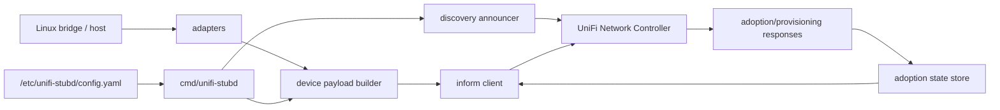
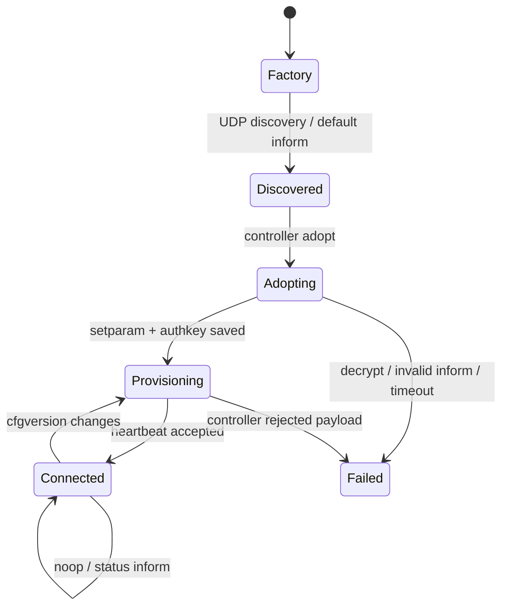

# Architecture

## Components

## Packages

| Package | Responsibility |
| --- | --- |
| `cmd/unifi-stubd` | CLI/daemon entrypoint |
| `internal/discovery` | Build and send UDP discovery TLVs |
| `internal/inform` | Encode/decode `TNBU` packets |
| `internal/adoption` | Authkey, cfgversion, and lifecycle state |
| `internal/device` | Build UniFi status payloads |
| `internal/adapters/linuxbridge` | Translate Linux bridge FDB data into MAC tables |
| `internal/observe` | Read-only Linux sysfs/FDB snapshot and payload merge |
| `internal/config` | Load runtime configuration |

## Runtime Layout

| Path | Content |
| --- | --- |
| `/usr/local/bin/unifi-stubd` | Program binary |
| `/etc/unifi-stubd/config.yaml` | Runtime config for controller, profile, MAC/IP, SSH adoption, and port speed |
| `/etc/unifi-stubd/ssh_host_rsa_key` | SSH host key for fake adoption |
| `/var/lib/unifi-stubd/adoption.env` | Persistent controller state, authkey, cfgversion, and inform URL |

## State Machine

## Design Decisions

### Fake Switch Before Fake Gateway

A switch profile mainly needs ports, interface state, MAC tables, and counters. A gateway profile needs WAN/LAN state, routing, DHCP, DPI, firewall, health, and more controller-specific fields. The switch MVP is therefore much more robust.

### No Real Provisioning

Controller commands are interpreted and persisted first, but not applied to the host. Anything that would mutate the host belongs in logs or debug output until it is explicitly implemented.

### Pin the Lab Version

UniFi Network changes implicit payload expectations. Development should pin one controller version in a VM first, then add more versions to a compatibility matrix.

## Data Sources for Proxmox

| Source | UniFi target |
| --- | --- |
| `bridge fdb show` | `port_table[].mac_table`, grouped by bridge member |
| `/sys/class/net/<if>/statistics/*` | rx/tx bytes, packets, errors |
| `ip -json addr` | `if_table` |
| `lldpcli -f json show neighbors` | later neighbor hints |
| Proxmox API | map VM names to MACs |
